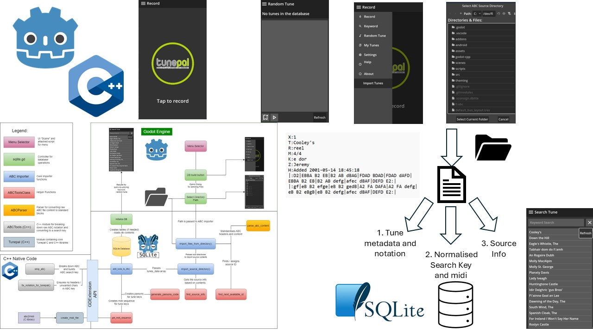

# Overview

Welcome to the landing page for Tunepal Nua: ABC Importer

## Description
This project is a contribution to **Tunepal Nua**:
A modern reinvention of the much loved [**Tunepal**](https://tunepal.org/index.html#!/record): Built using the Godot game engine.

A query-by-playing music retrieval system for Irish Traditional Music as well as a wide range of other repertoires.

Tunepal has been around for well over a decade. Created by Dr. Bryan Duggan of Technical University Dublin, "Tunepal Nua" will bring a range of new exciting features to users and lovers of irish music.

Please see post in [Dr. Bryan Duggan's Blog](https://bryanduggan.org/) for announcement on release of "Tunepal Nua".

One such feature: "ABC Importer" is the focus of the work carried out on this project: allowing a local SQLite database to be built on-device allowing offline searching.

## Summary of Contribution as part of this Project
One much sought-after feature in Tunepal has been the ability to search offline.

Musicians frequently find themselves in location with poor or no internet connection, unable to I.D a tune on their app. 

**The ABC Importer** addresses that problem: 

## What does it do?
"Tunepal Nua" is one codebase for all platforms: Rebuild of Tunepal built in Godot (GDSCript) and C++. 
This ABC importer is a new subsystem of this application that allows a local SQLite database to be built on-device.
It imports collections of tunes from ABC notation 
(a digitised shorthand musical score), and indexes all tune information to the SQLite database.

From one file, it parses it into individual "Tunes", 
generates search keys (for query-by-playing), midi sequences, 
and then indexes the tune's inforamtion to an SQLite database.

## Description of work carried out:
This feature was added to the prototype in Godot, and a contribution towards "Tunepal Nua" becoming an open source community.