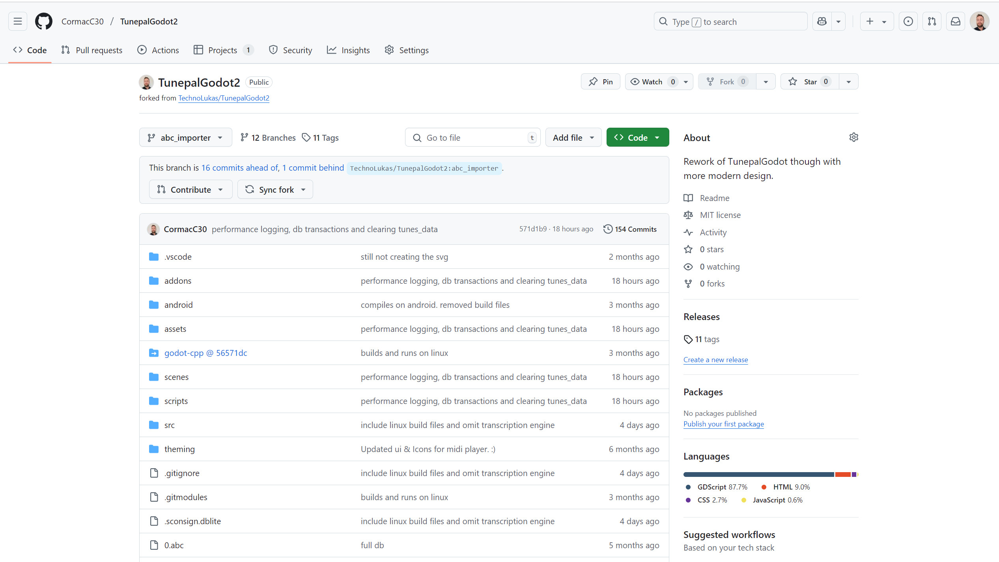

# Code Repository

- Contributions to the project were made [here](https://github.com/CormacC30/TunepalGodot2)
which is a Fork of the [main repository](https://github.com/TechnoLukas/TunepalGodot2)

## Branches
Most of the contributions were made to the [abc_importer](https://github.com/CormacC30/TunepalGodot2/tree/abc_importer) branch

Merged contributions on the main repository can be found [here](https://github.com/TechnoLukas/TunepalGodot2/tree/abc_importer).

