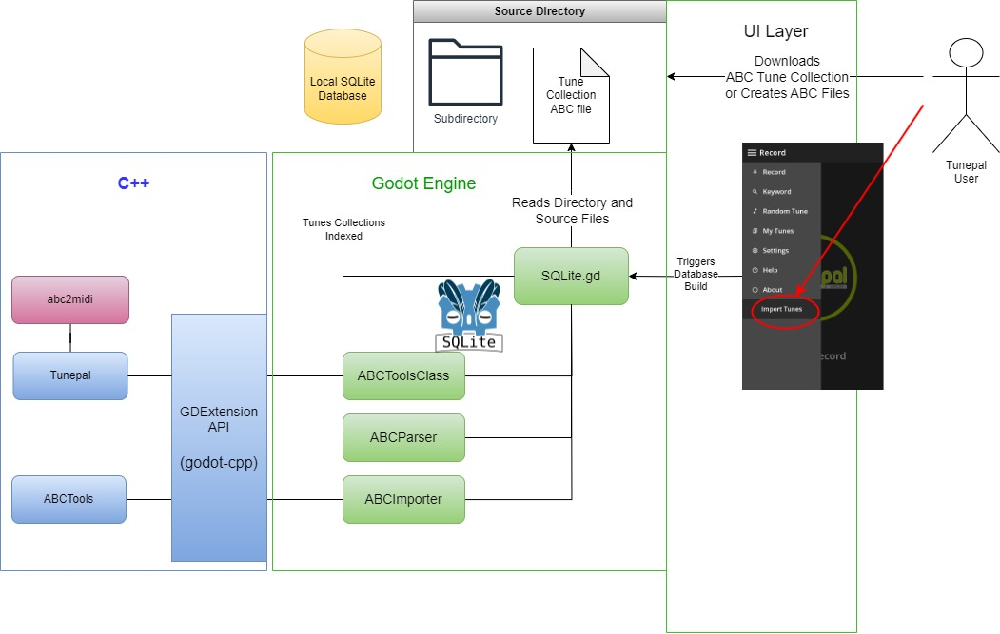

# System Architecture

This section contains some architectureal diagrams - which attempt to explain the architecture of *Tunepal Nua* with emphasis on the ABC importer.

The diagrams are as they appear in the final report.

### Overall

### Diving deeper

### Detailed
