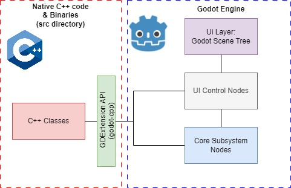
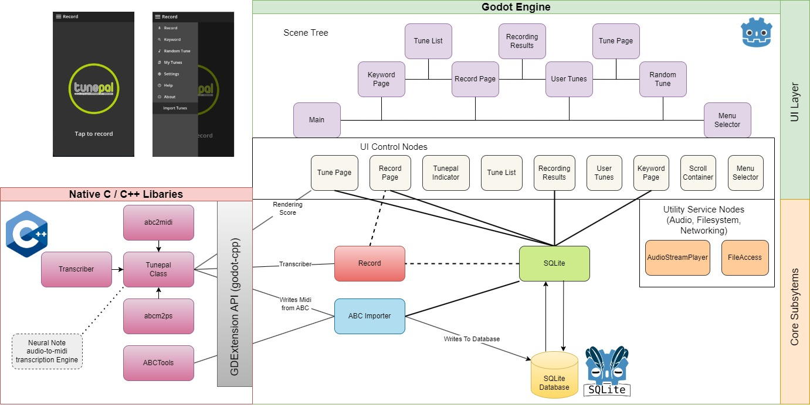
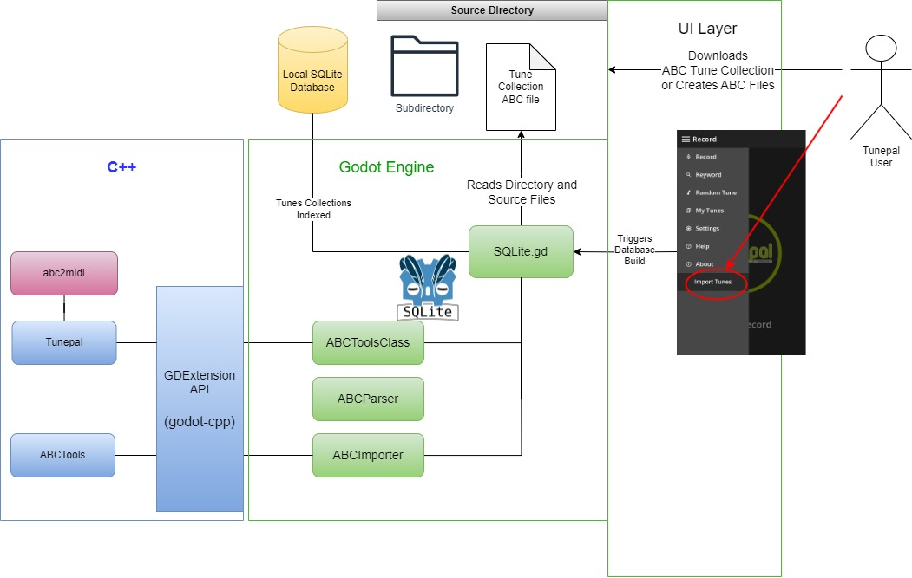

# System Architecture

This section contains some architectural diagrams - which attempt to explain the architecture of *Tunepal Nua* with emphasis on the ABC importer.

One of the primary advantages with the new Tunepal will be that it is all written in one codebase - for all platforms. 
The following graphical descriptions show how all of the components of this project are interconnected and how the *ABC Importer* fits into this picture.

The diagrams are as they appear in the final report.

### Tunepal full system:

Below shows a simplified graphical description of Tunepal Overall:
With functionality being governed within the Godot Engine, and some added features being written in C++ and utilised by Godot through the GDExtension API.

A more detailed view of the overall architecture of new Tunepal, including the ABC Importer is shown below:

### Overall

Focusing solely on ABC importer we the following architecture diagrams give further detail of specifically this system.

### Diving deeper
We can then examine the architecture in greater detail:

.jpg)