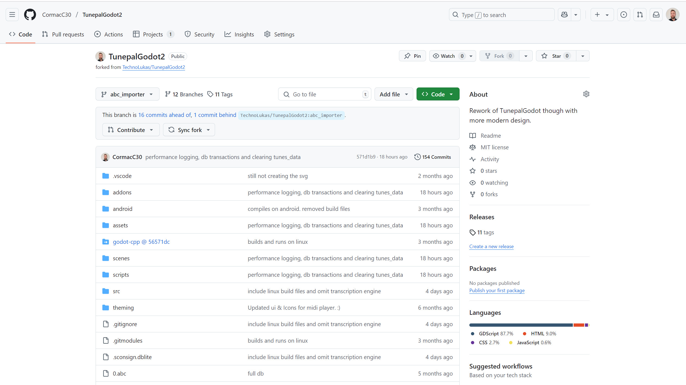
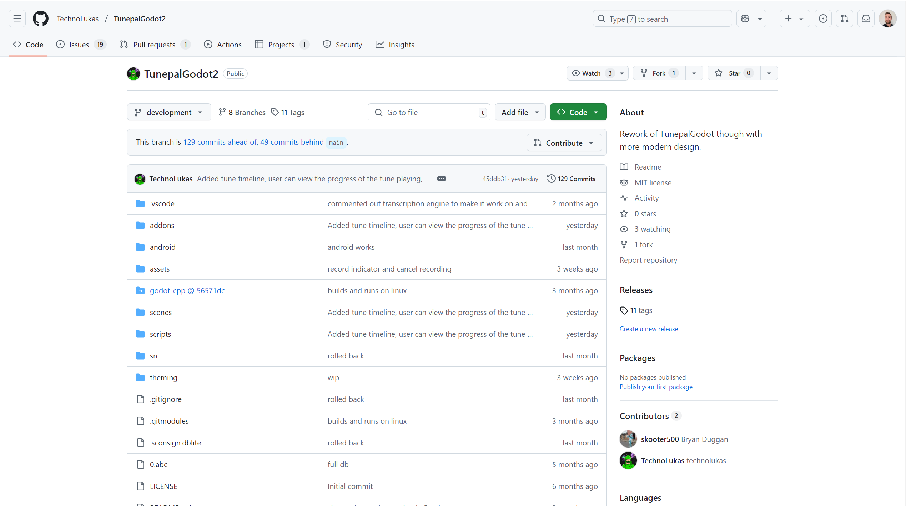

# Code Repository

- Contributions to the project were made [here](https://github.com/CormacC30/TunepalGodot2)
which is a Fork of the [main repository](https://github.com/TechnoLukas/TunepalGodot2)

## Branches
Most of the contributions were made to the [abc_importer](https://github.com/CormacC30/TunepalGodot2/tree/abc_importer) branch

Merged contributions on the main repository can be found [here](https://github.com/TechnoLukas/TunepalGodot2/tree/abc_importer).

## Pull Requests 
### ABC Importer
- [PR #36](https://github.com/TechnoLukas/TunepalGodot2/pull/36) (open)
- [PR #33](https://github.com/TechnoLukas/TunepalGodot2/pull/33) (closed)
- [PR #31](https://github.com/TechnoLukas/TunepalGodot2/pull/31) (closed)
- [PR #18](https://github.com/TechnoLukas/TunepalGodot2/pull/18) (closed)

### Investigatory work into integrating AI-Powered Audio-to-Midi transcription Engine 
- [PR #16](https://github.com/TechnoLukas/TunepalGodot2/pull/16)

Sometimes you want numbered lists:

1. One
2. Two
3. Three

Sometimes you want bullet points:

* Start a line with a star
* Profit!

Alternatively,

- Dashes work just as well
- And if you have sub points, put two spaces before the dash or star:
  - Like this
  - And this

## Images

If you want a link to a local image, place the image in the `img` folder and then insert a link like this:

Alternatively you can directly link to images on the web:

The above includes a title.

# Structured documents

Sometimes it's useful to have different levels of headings to structure your documents. Start lines with a `#` to create headings. Multiple `##` in a row denote smaller heading sizes.

### This is a third-tier heading

You can use one `#` all the way up to `######` six for different heading sizes.

If you'd like to quote someone, use the > character before the line:

> Coffee. The finest organic suspension ever devised... I beat the Borg with it.
> - Captain Janeway

There are many different ways to style code with GitHub's markdown. If you have inline code blocks, wrap them in backticks: `var example = true`.  If you've got a longer block of code, you can indent with four spaces:

    if (isAwesome){
      return true
    }

GitHub also supports something called code fencing, which allows for multiple lines without indentation:

~~~
if (isAwesome){
  return true
}
~~~

And if you'd like to use syntax highlighting, include the language:

~~~javascript
if (isAwesome){
  return true
}
~~~

