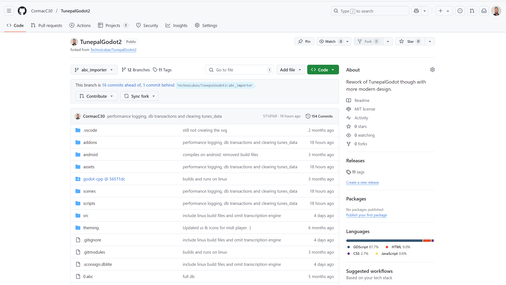
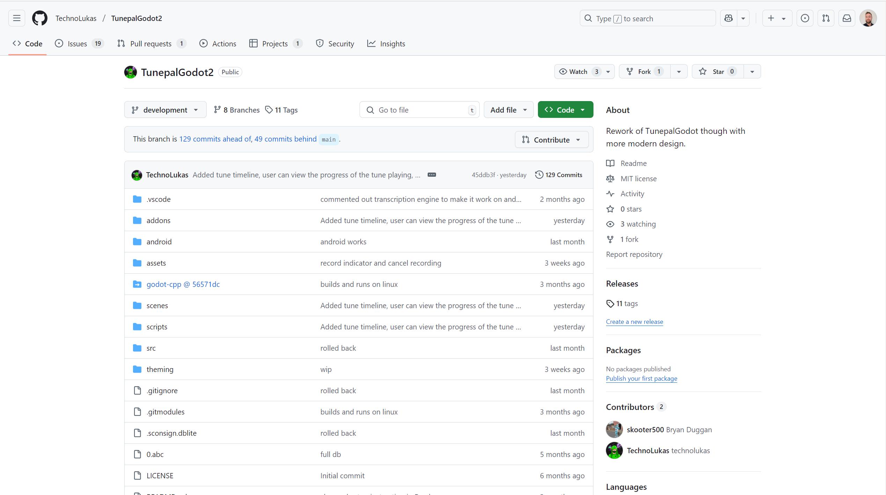

# Code Repository

- The codebase for Tunepal Nua built in Godot is found [here](https://github.com/TechnoLukas/TunepalGodot2)

- Contributions were made *via* this active fork [here](https://github.com/CormacC30/TunepalGodot2)

## Branches
Most of the contributions were made to the [abc_importer](https://github.com/CormacC30/TunepalGodot2/tree/abc_importer) branch.

Merged contributions on the main repository can be found [here](https://github.com/TechnoLukas/TunepalGodot2/tree/abc_importer).

With an open PR to [main branch found here](https://github.com/TechnoLukas/TunepalGodot2/pull/38)

Current head of the project is at [development](https://github.com/TechnoLukas/TunepalGodot2/tree/development)

